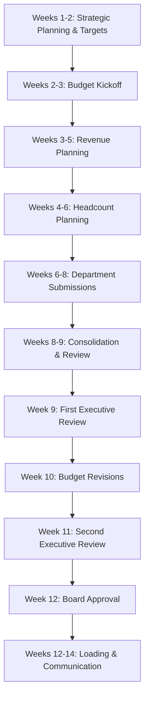

# Annual Planning and Budgeting Orchestration

## Overview
Comprehensive annual planning and budgeting process coordinating strategic planning, revenue targets, headcount planning, expense budgets, and capital allocation across the organization.

## Objective
Develop a realistic, strategic, and approved annual budget that aligns financial resources with company objectives, ensures departmental accountability, and supports effective performance management.

## Timeline
**Total Duration**: 12-14 weeks (3-3.5 months)
**Typical Start**: 3 months before fiscal year begins
**Example**: September start for January fiscal year

## Workflow Steps

### Weeks 1-2: Strategic Planning and Target Setting

**Agent**: fpa-advisor
**Skills**: financial-modeling, scenario-planning
**Activities**:

**Strategic Context:**
- Review company 3-5 year strategic plan
- Market opportunity assessment
- Competitive landscape analysis
- Strategic priorities for budget year
- Board/investor expectations

**Top-Down Target Setting:**
- Revenue growth target (based on market, strategy, capacity)
- Profitability target (EBITDA margin, path to profitability)
- Cash target (runway extension, profitability, fundraising needs)
- Market share or customer targets
- Key strategic initiatives requiring investment

**Scenario Development:**
- Base case: Balanced growth and profitability
- Aggressive case: Maximum growth, lower profitability
- Conservative case: Profitability focus, moderate growth

**Output**:
- Strategic context document
- Financial targets (revenue, EBITDA, cash)
- Strategic initiatives and investments
- Scenario frameworks

---

### Weeks 2-3: Budget Guidelines and Kickoff

**Agent**: fpa-advisor
**Command**: /budget-plan
**Parameters**:
- Fiscal year: [Next fiscal year]
- Phase: "kickoff"
- Strategic targets: [Revenue, EBITDA targets]

**Activities**:
- Prepare budget guidelines document
- Create budget templates
- Establish budget timeline and milestones
- Define approval process
- Communicate key assumptions and constraints
- Budget kickoff presentation to organization
- Department Q&A sessions

**Output**:
- Budget guidelines distributed
- Templates provided to all departments
- Timeline communicated
- Kickoff presentation delivered

---

### Weeks 3-5: Revenue Planning

**Agent**: financial-forecaster
**Command**: /financial-forecast
**Parameters**:
- Type: "annual"
- Base period: [Next fiscal year start]
- Scenarios: "base,upside,downside"

**Activities**:

**Sales Capacity Planning:**
- Quota per sales rep
- Sales headcount plan
- Ramp time for new hires
- Win rates and cycle times
- Seasonal patterns

**Customer-Based Revenue Model:**
- Beginning customer base
- New customer acquisition targets (by segment, product)
- Churn assumptions (historical trends + improvements)
- Expansion revenue assumptions (upsell, cross-sell rates)
- ARPU/ACV trends and pricing strategy

**Product/Segment Planning:**
- Revenue by product line
- New product launches and adoption curves
- Geographic expansion plans
- Channel revenue (direct, partner, etc.)

**Validation:**
- Bottom-up (sales capacity) vs. top-down (targets)
- Market sizing and penetration rates
- Comparison to industry benchmarks
- Scenario analysis (base, upside, downside)

**Output**:
- Detailed revenue forecast (monthly) for budget year
- Revenue by segment, product, geography
- Customer acquisition and retention assumptions
- Sales capacity model
- Three scenarios

---

### Weeks 4-6: Headcount Planning

**Agent**: fpa-advisor
**Skills**: financial-modeling, cost-allocation
**Activities**:

**Department Headcount Plans:**
- Beginning headcount (end of current year estimated)
- Growth needs by department (to support revenue plan)
- Backfill for expected attrition
- Timing of hires (phased throughout year)
- Role levels and compensation bands
- Geographic distribution (impact on costs)

**Headcount Review Meetings:**
- Sales & Marketing: Support revenue targets
- R&D/Engineering: Product roadmap and innovation
- G&A: Scaling support functions appropriately
- Operations/Service: Customer support needs

**Headcount Metrics:**
- Revenue per employee (benchmark targets)
- Department ratios (% of total headcount)
- Span of control (manager to IC ratio)
- Comparison to prior year and industry

**Output**:
- Consolidated headcount plan (monthly by department)
- Hiring timeline
- Compensation assumptions
- Headcount metrics validation

---

### Weeks 6-8: Department Budget Submissions

**Agent**: cost-optimizer (support)
**Command**: /budget-plan
**Parameters**:
- Fiscal year: [Next fiscal year]
- Phase: "templates"
- Departments: [All departments]

**Activities**:

**Personnel Budgets** (each department):
- Salaries based on headcount plan
- Benefits and payroll taxes (25-35% load)
- Bonuses (target % for eligible employees)
- Stock-based compensation (grants for new hires + refreshes)
- Raises and promotions (merit pool)

**Non-Personnel Budgets** (each department):
- Software and technology
- Marketing and advertising programs
- Professional services (consultants, contractors)
- Travel and entertainment
- Events and conferences
- Office and supplies
- Training and development
- Department-specific expenses

**Capital Expenditure Budgets:**
- Equipment and hardware
- Leasehold improvements
- Major software implementations
- Infrastructure projects

**Templates Provided:**
- Headcount planning template
- Personnel expense template
- Non-personnel expense template (by category)
- CapEx request template
- Justification for new investments

**Output**:
- Department budget submissions (all departments)
- Supporting justifications
- Link to strategic initiatives
- Headcount detail

---

### Weeks 8-9: Budget Consolidation and Review

**Agent**: fpa-advisor
**Command**: /budget-plan
**Parameters**:
- Fiscal year: [Next fiscal year]
- Phase: "consolidation"
- Submissions: "all-departments"

**Activities**:

**Consolidation:**
- Compile all department submissions
- Eliminate duplications
- Validate intercompany allocations
- Build consolidated P&L
- Build balance sheet (working capital, CapEx, debt)
- Build cash flow statement
- Calculate key metrics

**First-Pass Analysis:**
- Compare to strategic targets
- Revenue vs. top-down target
- EBITDA vs. profitability target
- Cash flow and runway
- Headcount vs. efficiency targets
- Identify gaps or excesses

**Finance Review:**
- Reasonableness check (growth rates, margins)
- Benchmark vs. industry
- Scenario testing
- Cash flow stress testing
- Identify issues requiring attention

**Output**:
- Consolidated first-pass budget
- Gap analysis vs. targets
- Issues list
- Recommendations for iterations

---

### Weeks 9-11: Iteration and Executive Review

**Agent**: fpa-advisor
**Skills**: scenario-planning, financial-modeling

**First Executive Review** (Week 9):
- Present consolidated budget
- Highlight gaps to targets
- Discuss trade-offs
- Identify areas for revision
- Assign revision priorities

**Budget Revisions** (Week 10):
- Department budget adjustments
- Re-prioritization of investments
- Phasing of hires or spend (if over budget)
- Additional investments (if under target)
- Re-consolidation

**Second Executive Review** (Week 11):
- Revised budget presentation
- Comparison to first pass and targets
- Scenario analysis (base, aggressive, conservative)
- Sensitivity analysis on key assumptions
- Risk assessment
- Final executive approval (pending board)

**Agent**: scenario-analysis
**Command**: /scenario-analysis
**Parameters**:
- Decision: "annual-budget-scenarios"
- Horizon: "1-year"
- Scenarios: "base,aggressive,conservative"

**Output**:
- Approved budget (pending board approval)
- Scenario variants
- Sensitivity analysis
- Risk assessment
- Executive sign-off

---

### Week 12: Board Approval

**Agent**: fpa-advisor, financial-reporter
**Command**: /board-package-generate
**Parameters**:
- Period: [Budget fiscal year]
- Meeting type: "budget-approval"

**Activities**:

**Board Package Preparation:**
- Budget summary (1-2 pages)
- Year-over-year comparison
- Strategic context and assumptions
- Revenue plan and assumptions
- Headcount plan
- Expense detail
- CapEx and cash flow
- Key metrics and benchmarks
- Risks and sensitivities
- Scenario analysis

**Board Presentation:**
- Strategic rationale
- Revenue growth plan
- Investment priorities
- Path to profitability (or margin improvement)
- Resource allocation
- Risk mitigation
- Request for approval

**Board Approval:**
- Board review and Q&A
- Revisions if needed
- Formal approval vote
- Authorization for implementation

**Output**:
- Board-approved annual budget
- Authorized headcount plan
- Approved CapEx
- Board minutes documenting approval

---

### Weeks 12-14: Budget Loading and Communication

**Agent**: fpa-advisor, financial-reporter
**Command**: /budget-plan
**Parameters**:
- Fiscal year: [Next fiscal year]
- Phase: "communication"

**Activities**:

**Budget System Loading:**
- Load approved budget into financial system (NetSuite, SAP, etc.)
- Monthly detail by account, department, cost center
- Validate totals match approved budget
- Set up variance reporting
- Configure budget vs. actual reports

**Department Communication:**
- Budget letters to each department leader
- Budget detail (revenue, headcount, expenses)
- Key assumptions
- Performance expectations
- Variance reporting requirements
- Budget amendment process

**Organization-Wide Communication:**
- Company-wide announcement
- Strategic priorities
- Growth plan
- Key initiatives
- Performance expectations
- Teamwork and collaboration

**Budget Administration:**
- Expense approval limits
- Headcount requisition process
- CapEx approval process
- Budget transfer procedures
- Variance reporting cadence (monthly)
- Reforecast triggers and process

**Output**:
- Budget loaded in systems
- Department budget letters distributed
- Organization communication delivered
- Budget processes documented
- Ready for fiscal year start

---

## Orchestration Flow

## Key Milestones

**End of Week 2**: Budget kickoff complete, templates distributed
**End of Week 5**: Revenue plan finalized
**End of Week 6**: Headcount plan finalized
**End of Week 8**: All department budgets submitted
**End of Week 9**: Consolidated budget, first executive review
**End of Week 11**: Revised budget, executive approval
**End of Week 12**: Board approval obtained
**End of Week 14**: Budget loaded, communicated, ready for FY start

## Success Criteria

**Process Quality:**
- On-time completion
- Full participation from all departments
- Strategic alignment
- Realistic and achievable targets

**Budget Quality:**
- Aligns with strategic plan
- Revenue targets achievable (bottoms-up validation)
- Appropriate investment levels
- Cash flow sustainable
- Competitive benchmarking

**Stakeholder Buy-In:**
- Department leader ownership
- Executive team alignment
- Board approval
- Organization understanding and commitment

## Agents Involved
- **fpa-advisor**: Overall orchestration, strategic planning, target setting, executive review
- **financial-forecaster**: Revenue planning, forecasting
- **cost-optimizer**: Expense efficiency review (optional support)
- **financial-reporter**: Board package, communication, system loading

## Skills Utilized
- financial-modeling
- scenario-planning
- financial-forecasting-methods
- budget-variance-analysis
- cost-allocation
- management-reporting

## Related Commands
- /budget-plan
- /financial-forecast
- /scenario-analysis
- /board-package-generate

---

**Orchestration Type**: Annual workflow
**Typical Duration**: 12-14 weeks (3-3.5 months)
**Complexity**: Very High (cross-functional, strategic, high stakes)
**Business Value**: Critical for annual planning and resource allocation
