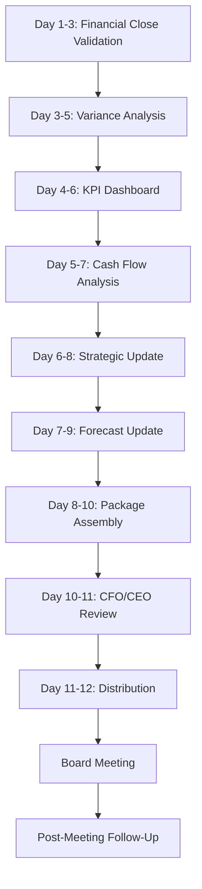

# Board Reporting Orchestration

## Overview
Orchestrated board reporting preparation workflow ensuring comprehensive, accurate, and strategic board packages are delivered on time for board meetings.

## Objective
Prepare professional, insightful board reporting packages that provide board members with financial performance visibility, strategic updates, key decisions, and forward-looking guidance to support effective board governance.

## Timeline
**Standard Timeline**: 10-12 days before board meeting
**Emergency/Special Meeting**: 3-5 days

## Workflow Steps

### Day 1-3: Financial Close and Results Compilation

**Prerequisites:**
- Month-end close completed (see month-end-close orchestration)
- Financial statements finalized
- Variance analysis complete

**Agent**: financial-reporter
**Command**: /month-end-close-status
**Parameters**:
- Period: [Board meeting month]
- View: "post-close-validation"

**Activities**:
- Validate month-end close completion
- Verify all reconciliations complete
- Confirm variance analysis finalized
- Review for any late adjustments
- Final sign-off from CFO on financials

**Output**:
- Finalized financial statements
- Completed variance analysis
- Close certification

---

### Day 3-5: Variance Analysis and Commentary

**Agent**: budget-variance-analyst
**Command**: /budget-variance
**Parameters**:
- Period: [Board meeting period]
- Departments: all
- Threshold: "$100K or 10%"
- Format: "board-summary"

**Activities**:
- Comprehensive variance analysis (vs. budget, prior year, forecast)
- Root cause investigation for material variances
- Business context and drivers
- Forward-looking implications
- Full-year forecast impact assessment
- Executive-level variance commentary (concise, strategic)

**Output**:
- Variance analysis suitable for board review
- Top 5 favorable/unfavorable variance explanations
- Trend analysis showing patterns
- Forecast implications

---

### Day 4-6: KPI Dashboard and Metrics

**Agent**: financial-reporter
**Command**: /kpi-dashboard
**Parameters**:
- Type: "board"
- Period: [Board meeting period]
- Format: "powerpoint"
- Include trends: "12-months"

**Activities**:

**Financial Metrics:**
- Revenue (actual, budget, forecast, growth%)
- EBITDA and margin %
- Gross margin %
- Operating cash flow
- Cash balance and runway
- Rule of 40 (for SaaS)

**Customer Metrics:**
- Customer count and growth
- Net Revenue Retention (NRR)
- Gross Revenue Retention (GRR)
- Customer Acquisition Cost (CAC)
- CAC payback period
- Lifetime Value (LTV) and LTV/CAC ratio
- Net Promoter Score (NPS)

**Operational Metrics:**
- Headcount (actual vs. plan)
- Revenue per employee
- Key product/service metrics
- Sales efficiency
- Marketing ROI

**Trend Visualizations:**
- 12-month trends for key metrics
- Quarterly trending
- Year-over-year comparisons

**Output**:
- Comprehensive KPI dashboard
- Trend charts
- Board-appropriate visualizations

---

### Day 5-7: Cash Flow and Runway Analysis

**Agent**: cash-flow-analyst
**Command**: /cash-flow-projection
**Parameters**:
- Horizon: "quarterly"
- Start date: [Current quarter]
- Scenarios: "base,stressed"
- Purpose: "board-reporting"

**Activities**:
- Detailed cash flow analysis
- Cash runway calculation (months)
- Working capital trends (DSO, DPO, CCC)
- Liquidity ratios
- Debt covenant compliance (if applicable)
- Scenario-based cash projections
- Funding need assessment (if applicable)

**Output**:
- Cash flow analysis
- Runway calculation and trends
- Working capital analysis
- Liquidity assessment
- Funding recommendations (if needed)

---

### Day 6-8: Strategic Update and Business Highlights

**Agent**: fpa-advisor (supporting CFO/CEO)
**Skills**: management-reporting
**Activities**:

**Business Highlights:**
- Major customer wins or expansions
- New product launches or features
- Strategic partnerships or alliances
- Key hires or organizational changes
- Awards, recognition, press coverage

**Strategic Initiative Updates:**
- Status of major initiatives (on track / at risk)
- Milestones achieved this period
- Key accomplishments
- Challenges and mitigation plans
- Resource needs or adjustments

**Market and Competitive Update:**
- Market trends affecting business
- Competitive landscape changes
- Regulatory or legal developments
- Technology or industry shifts

**Challenges and Issues:**
- Significant customer losses or churn drivers
- Operational challenges
- Resource constraints
- Risk factors
- Mitigation strategies

**Output**:
- Strategic update section
- Business highlights summary
- Initiative status report
- Challenges and mitigations documented

---

### Day 7-9: Forecast Update and Forward-Looking Section

**Agent**: financial-forecaster
**Command**: /financial-forecast (if material changes)
**Parameters**:
- Type: "rolling-4q"
- Scenarios: "base,upside,downside"
- Purpose: "board-update"

**Activities**:

**Forecast Assessment:**
- Current forecast vs. latest results
- Need for forecast revision
- Guidance implications (for public companies)

**If Material Changes:**
- Updated revenue forecast
- Revised EBITDA and margin outlook
- Cash flow and runway projections
- Key assumption changes
- Scenario analysis

**Forward-Looking Commentary:**
- Next quarter outlook
- Full-year guidance (reaffirm / update)
- Key opportunities
- Key risks and mitigation
- Strategic priorities next quarter

**Output**:
- Updated forecast (if material changes)
- Forward-looking commentary
- Guidance recommendation
- Scenario comparison

---

### Day 8-10: Executive Summary and Package Assembly

**Agent**: financial-reporter
**Command**: /board-package-generate
**Parameters**:
- Period: [Board meeting period]
- Meeting date: [Board meeting date]
- Type: "quarterly" or "monthly"

**Activities**:

**Executive Summary** (1-2 pages):
- Overall performance assessment
- Financial and operational highlights
- Major accomplishments
- Critical challenges and mitigation
- Strategic decisions requiring board input
- Recommended actions and approvals

**Package Assembly:**
1. Executive Summary (1-2 pages)
2. Financial Dashboard (1 page - KPIs and metrics)
3. Financial Statements (3-4 pages - P&L, Balance Sheet, Cash Flow)
4. Variance Analysis (2 pages)
5. Operational Metrics (2 pages)
6. Business Highlights (2-3 pages)
7. Strategic Initiatives Update (2-3 pages)
8. Forward Look and Forecast (2-3 pages)
9. Appendix: Supporting schedules and detail

**Quality Review:**
- Accuracy check (numbers reconcile)
- Consistency check (same story throughout)
- Clarity check (insights clear, actionable)
- Formatting check (professional, consistent)
- Proofreading (no typos, grammatical errors)

**Output**:
- Complete board package (PDF)
- PowerPoint presentation version
- Standalone executive summary
- Supporting appendices

---

### Day 10-11: CFO/CEO Review and Refinement

**Agent**: fpa-advisor (supporting CFO)
**Activities**:
- CFO comprehensive review
- CEO review for strategic sections
- Executive team final review
- Incorporate feedback
- Final refinements
- Approval for distribution

**Review Checklist:**
- Numbers accurate and reconciled
- Story is clear and compelling
- Insights actionable
- Decisions clearly articulated
- Risks appropriately highlighted
- Professionally formatted
- Ready for board scrutiny

**Output**:
- Board package approved by CFO and CEO
- Ready for distribution

---

### Day 11-12: Distribution and Pre-Meeting Support

**Agent**: financial-reporter
**Activities**:

**Distribution:**
- Upload to board portal (secure)
- Email to board members (if no portal)
- Confirm receipt by all members
- Distribution to executive team
- Archive package for records

**Pre-Meeting Support:**
- Prepare for board member questions
- Develop Q&A anticipation
- Prepare backup materials
- Brief CFO and CEO on key points
- Coordinate with other presenters

**Meeting Preparation:**
- Print copies for meeting
- Prepare presentation materials
- Test technology (if virtual)
- Coordinate agenda and timing

**Output**:
- Board package distributed 3-5 days before meeting
- Pre-meeting preparation complete
- Q&A preparation materials
- Meeting logistics confirmed

---

### Post-Meeting: Documentation and Follow-Up

**Agent**: financial-reporter
**Activities**:

**Meeting Documentation:**
- Capture board questions and answers
- Document decisions and approvals
- Note action items and owners
- Record feedback for next package
- Minutes preparation support

**Follow-Up Actions:**
- Distribute action items to owners
- Track completion of board requests
- Prepare additional materials if requested
- File final package with meeting materials

**Process Improvement:**
- Note improvements for next board package
- Refine templates based on feedback
- Update standard board metrics if needed

**Output**:
- Meeting documentation
- Action items tracked
- Process improvements captured

---

## Orchestration Flow

## Key Milestones

**Day 3**: Financial close certified, results final
**Day 5**: Variance analysis complete
**Day 7**: KPIs and cash flow analysis complete
**Day 9**: Strategic update and forecast complete
**Day 10**: Board package assembled, quality review complete
**Day 11**: CFO/CEO approval obtained
**Day 12**: Package distributed (3-5 days before meeting)

## Board Package Components

### Standard Monthly/Quarterly Package (15-25 pages):
1. Executive Summary (2 pages)
2. Financial Dashboard (1 page)
3. Financial Statements (3-4 pages)
4. Variance Analysis (2 pages)
5. KPIs and Metrics (2 pages)
6. Business Highlights (2-3 pages)
7. Strategic Initiatives (2-3 pages)
8. Forward Look (2 pages)
9. Appendix (as needed)

### Special Topics (as needed):
- Fundraising updates
- M&A opportunities
- Strategic pivots
- Significant legal/regulatory matters
- Major customer/partner developments

## Success Metrics

**Timeliness:**
- Package distributed 3-5 days before meeting: Yes/No
- On-time delivery rate: >95%

**Quality:**
- Accuracy: No material errors
- Completeness: All required sections included
- Clarity: Board members understand without explanation
- Actionable: Decisions clearly presented

**Board Satisfaction:**
- Board member feedback
- Questions requiring follow-up (<5 per meeting)
- Package usefulness rating

## Exception Handling

**Late Financial Close:**
- Compress review timeline
- Prioritize critical content
- Use estimates with appropriate disclaimers
- Provide update at meeting if needed

**Material Events After Distribution:**
- Prepare supplemental memo
- Distribute immediately
- Present at beginning of meeting
- Update package for records

**Special/Emergency Meetings:**
- Abbreviated timeline (3-5 days)
- Focus on specific decision topic
- Standard financials may be summary-level
- Deep dive on decision at hand

## Agents Involved
- **financial-reporter**: Primary orchestrator, package assembly, distribution
- **budget-variance-analyst**: Variance analysis and commentary
- **cash-flow-analyst**: Cash flow and runway analysis
- **financial-forecaster**: Forecast updates (if needed)
- **fpa-advisor**: Strategic support, executive review support

## Skills Utilized
- management-reporting
- budget-variance-analysis
- cash-flow-management
- financial-forecasting-methods
- gaap-ifrs-compliance
- scenario-planning

## Related Commands
- /board-package-generate
- /budget-variance
- /kpi-dashboard
- /cash-flow-projection
- /financial-forecast

---

**Orchestration Type**: Recurring (monthly or quarterly) workflow
**Typical Duration**: 10-12 days
**Complexity**: High (multiple agents, high visibility, executive scrutiny)
**Business Value**: Critical for board governance and oversight
