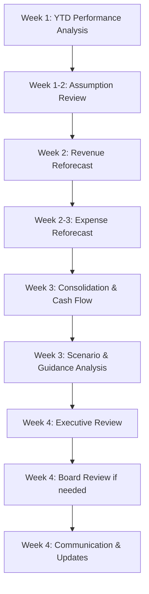

# Budget Review and Reforecast Orchestration

## Overview
Mid-year budget review and reforecast process to assess performance against budget, update outlook based on actuals and trends, and revise guidance if necessary.

## Objective
Conduct comprehensive budget review (typically mid-year), analyze variances, update full-year forecast based on actual performance and revised assumptions, and communicate revised outlook to stakeholders.

## Timeline
**Typical Timing**: Mid-year (after Q2 close) or after Q3 close
**Duration**: 3-4 weeks

## Workflow Steps

### Week 1: YTD Performance Analysis

**Agent**: budget-variance-analyst
**Command**: /budget-variance
**Parameters**:
- Period: "YTD" (e.g., "YTD Q2 2024")
- Departments: all
- Threshold: "$100K or 10%"
- Include trends: true

**Activities**:

**YTD Variance Analysis:**
- Revenue: Actual vs. budget YTD
- Expenses: Actual vs. budget YTD by department
- EBITDA: Actual vs. budget YTD
- Cash: Actual vs. budget YTD
- Headcount: Actual vs. budget YTD

**Variance Deep Dive:**
- Identify systematic variances (recurring patterns)
- Separate one-time vs. ongoing variances
- Assess controllable vs. uncontrollable variances
- Classify as timing vs. permanent variances
- Document root causes with business context

**Trend Analysis:**
- Monthly trending (improving / deteriorating)
- Variance patterns (widening / stabilizing)
- Forecast accuracy assessment
- Early indicators of issues

**Output**:
- Comprehensive YTD variance analysis
- Permanent vs. temporary variance classification
- Trending and patterns identified
- Root cause documentation

---

### Week 1-2: Performance Assessment and Assumption Review

**Agent**: financial-forecaster
**Skills**: financial-forecasting-methods, budget-variance-analysis
**Activities**:

**Budget Assumption Review:**
Review original budget assumptions vs. reality:

**Revenue Assumptions:**
- Customer acquisition: Budget vs. actual
- Churn rates: Budget vs. actual
- ARPU/ACV: Budget vs. actual
- Market conditions: As expected / changed
- Competitive landscape: As expected / changed
- Pricing strategy: On track / adjusted

**Expense Assumptions:**
- Headcount plan: Hiring on track / behind / ahead
- Attrition: As expected / higher / lower
- Compensation: On budget / over / under
- Discretionary spend: Tracking to plan
- Investment levels: As planned / adjusted

**External Factors:**
- Economic conditions: As assumed / changed
- Market dynamics: As assumed / changed
- Regulatory environment: Stable / changed
- Technology landscape: As assumed / evolved

**Assumption Update Decisions:**
```
For each key assumption:
1. Was original budget assumption accurate?
2. What has changed since budget?
3. What should we assume for remainder of year?
4. What's the confidence level in new assumption?
```

**Output**:
- Assumption review summary
- Changes from budget assumptions
- Revised assumptions for remainder of year
- Confidence assessment

---

### Week 2: Revised Revenue Forecast

**Agent**: financial-forecaster
**Command**: /financial-forecast
**Parameters**:
- Type: "remainder-of-year"
- Base period: [Next month]
- Scenarios: "base,upside,downside"

**Activities**:

**YTD Actuals:**
- Lock in actual revenue YTD
- Analyze by segment, product, geography
- Understand what drove performance vs. budget

**Remaining Months Forecast:**
- Customer forecast (beginning + adds - churn)
- ARPU/ACV forecast (trends, pricing changes)
- Seasonality application
- New product/market impacts
- Known pipeline and conversion

**Full-Year Build:**
- YTD Actuals + Remaining months forecast
- Comparison to original budget
- Variance to budget with explanations
- Confidence level assessment

**Scenario Development:**
- Base: Most likely outcome (revised outlook)
- Upside: If things go better than base
- Downside: If challenges materialize

**Output**:
- Revised revenue forecast (remaining months + full year)
- Comparison to budget
- Scenario variants
- Confidence assessment

---

### Week 2-3: Revised Expense and Headcount Forecast

**Agent**: financial-forecaster, cost-optimizer
**Skills**: financial-forecasting-methods, cost-allocation
**Activities**:

**Headcount Reforecast:**
- Current headcount (actual end of last month)
- Hiring pipeline and timing (updated vs. budget)
- Attrition forecast (updated based on actuals)
- Department-by-department headcount forecast
- Comparison to budget headcount plan
- Identify hiring delays or accelerations

**Personnel Expense Reforecast:**
- Salaries based on revised headcount
- Benefits and taxes
- Bonuses (updated based on performance)
- Stock compensation
- Raises and promotions

**Non-Personnel Expense Reforecast:**
- Software and technology (actual trends)
- Marketing (updated ROI, pipeline needs)
- Professional services (updated needs)
- Facilities (actual usage)
- T&E (updated based on actuals)
- Other categories

**CapEx Reforecast:**
- Completed projects YTD
- In-progress project timing
- Deferred projects
- New projects identified
- Revised CapEx forecast vs. budget

**Cost Optimization (if needed):**
If expenses trending over budget or revenue under:
- Identify cost reduction opportunities
- Assess impact on business
- Recommend adjustments
- Model P&L impact

**Output**:
- Revised headcount forecast
- Revised expense forecast (personnel and non-personnel)
- Revised CapEx forecast
- Cost optimization recommendations (if applicable)
- Comparison to budget

---

### Week 3: Consolidated Reforecast and Cash Flow

**Agent**: financial-forecaster
**Skills**: financial-modeling, cash-flow-management
**Activities**:

**Consolidated P&L Reforecast:**
- Integrate revised revenue and expense forecasts
- Build complete P&L (remaining months + full year)
- Calculate margins (gross, EBITDA, operating, net)
- Compare to budget and prior guidance
- Variance explanations

**Balance Sheet Forecast:**
- Working capital (updated DSO, DPO assumptions)
- CapEx and depreciation
- Debt schedule
- Equity changes

**Agent**: cash-flow-analyst
**Command**: /cash-flow-projection
**Parameters**:
- Horizon: "remainder-of-year"
- Start date: [Current month]
- Scenarios: "base,stressed"

**Cash Flow Forecast:**
- Operating cash flow (from P&L + working capital)
- Investing cash flow (CapEx)
- Financing cash flow (debt, equity)
- Ending cash and runway
- Scenario analysis

**Key Metrics:**
- Revenue growth %
- EBITDA and margin %
- Burn rate (if pre-profitability)
- Runway (months of cash)
- Cash conversion
- Efficiency metrics

**Output**:
- Complete reforecast (P&L, Balance Sheet, Cash Flow)
- Scenarios (base, upside, downside)
- Key metrics
- Comparison to budget and prior guidance

---

### Week 3: Scenario Analysis and Guidance Decision

**Agent**: fpa-advisor
**Command**: /scenario-analysis
**Parameters**:
- Decision: "guidance-update"
- Horizon: "remainder-of-year"
- Scenarios: "base,upside,downside,maintain-guidance"

**Activities**:

**Guidance Assessment:**
```
Scenario Analysis:
1. Maintain current guidance (original budget)
   - Likelihood of achievement
   - Actions required to close gap
   - Risks

2. Update to revised base case forecast
   - New revenue and EBITDA guidance
   - Variance to prior guidance
   - Explanation and rationale

3. Update with range (e.g., $X-Y revenue)
   - Reflects uncertainty
   - Scenarios driving range
   - Probabilities

4. Withdraw guidance (if appropriate)
   - Significant uncertainty
   - Major changes in assumptions
   - Market volatility
```

**Recommendation Development:**
- Guidance approach recommendation
- Supporting analysis
- Communication strategy
- Risk assessment

**Output**:
- Scenario comparison
- Guidance recommendation
- Communication strategy
- Risk and sensitivity analysis

---

### Week 4: Executive and Board Review

**Agent**: fpa-advisor
**Skills**: management-reporting, scenario-planning
**Activities**:

**Executive Review Package:**
- YTD performance summary
- Variance analysis and explanations
- Revised forecast (scenarios)
- Comparison to budget
- Guidance recommendation
- Key assumptions and changes
- Risks and opportunities
- Recommended actions

**Executive Team Review:**
- Presentation of reforecast
- Discussion of assumptions
- Guidance decision
- Resource allocation decisions
- Course corrections needed
- Approval for board presentation

**Board Review Package:**
```
If material change requiring board notification:
1. Executive summary of reforecast
2. YTD performance vs. budget
3. Revised full-year outlook
4. Variance explanations
5. Assumption changes
6. Scenario analysis
7. Guidance recommendation
8. Risk assessment
```

**Agent**: financial-reporter
**Command**: /board-package-generate (if needed)
**Parameters**:
- Period: "budget-reforecast"
- Type: "special-topic"

**Output**:
- Executive approval of reforecast
- Board notification (if required)
- Guidance decision finalized
- Communication plan approved

---

### Week 4: Communication and System Updates

**Agent**: fpa-advisor, financial-reporter
**Activities**:

**Internal Communication:**
- Department leader updates
  - Revised budgets (if applicable)
  - Performance expectations
  - Resource adjustments
  - Action plans
- Organization communication (if appropriate)
  - Company-wide update
  - Revised targets and priorities

**External Communication (if applicable):**
- Investor update (for public companies)
- Updated guidance announcement
- Earnings call preparation
- Analyst communication

**System Updates:**
- Load revised forecast into systems
- Update reporting comparatives
- Refresh variance analysis baselines
- Update dashboard targets

**Documentation:**
- Archive reforecast package
- Document assumptions and rationale
- Track reforecast vs. actuals (for learning)
- Process improvement notes

**Output**:
- Reforecast communicated to stakeholders
- Systems updated
- Documentation archived
- Ready for ongoing variance tracking vs. reforecast

---

## Orchestration Flow



## Key Milestones

**End of Week 1**: YTD variance analysis complete, patterns identified
**End of Week 2**: Assumptions reviewed, revenue reforecast complete
**End of Week 3**: Full reforecast complete, scenarios developed
**Mid Week 4**: Executive approval obtained
**End of Week 4**: Communication complete, systems updated

## Typical Reforecast Triggers

**Timing-Based:**
- Mid-year (after Q2): Standard practice
- After Q3: If mid-year reforecast now outdated
- Major milestone reviews

**Performance-Based:**
- Material variance (>15-20% for quarter)
- Systematic variance trends
- Significant budget miss likely

**Business Change-Based:**
- Major strategic pivot
- Significant M&A activity
- Large customer win or loss
- Market disruption
- Regulatory changes
- Economic shock

## Guidance Update Scenarios

### Scenario 1: Raise Guidance
**Situation**: Strong YTD performance, trends sustainable
**Actions**:
- Quantify upside vs. budget
- Validate sustainability
- Update guidance (specific or range)
- Communicate rationale and drivers

### Scenario 2: Lower Guidance
**Situation**: Underperforming vs. budget, gap closing unlikely
**Actions**:
- Assess shortfall magnitude
- Identify mitigation actions
- Revise guidance (realistic but achievable)
- Communicate challenges and response plan

### Scenario 3: Maintain Guidance
**Situation**: YTD variance but full-year achievable
**Actions**:
- Document path to guidance achievement
- Identify actions required to close gap
- Monitor closely
- Communicate confidence in maintaining

### Scenario 4: Provide Range
**Situation**: Significant uncertainty in outlook
**Actions**:
- Define range based on scenarios
- Explain factors driving uncertainty
- Commit to update at next review

## Success Metrics

**Accuracy:**
- Reforecast accuracy vs. final actuals
- Improved forecast vs. original budget

**Timeliness:**
- Complete reforecast within 3-4 weeks
- Communication timely

**Actionability:**
- Mitigation plans for shortfalls
- Resource reallocation decisions
- Course corrections implemented

**Stakeholder Value:**
- Management decision support
- Board confidence in outlook
- Investor/stakeholder communication (if applicable)

## Agents Involved
- **budget-variance-analyst**: YTD variance analysis, root cause identification
- **financial-forecaster**: Reforecasting revenue and expenses
- **cash-flow-analyst**: Cash flow projections and runway
- **cost-optimizer**: Cost optimization opportunities (if needed)
- **fpa-advisor**: Scenario analysis, guidance recommendation, executive support
- **financial-reporter**: Communication and reporting

## Skills Utilized
- budget-variance-analysis
- financial-forecasting-methods
- financial-modeling
- cash-flow-management
- scenario-planning
- cost-allocation
- management-reporting

## Related Commands
- /budget-variance
- /financial-forecast
- /cash-flow-projection
- /scenario-analysis
- /cost-analysis (if needed)
- /board-package-generate (if board involved)

---

**Orchestration Type**: Periodic (typically mid-year, or as-needed)
**Typical Duration**: 3-4 weeks
**Complexity**: High (comprehensive review, strategic decisions)
**Business Value**: Critical for maintaining forecast accuracy and stakeholder confidence
