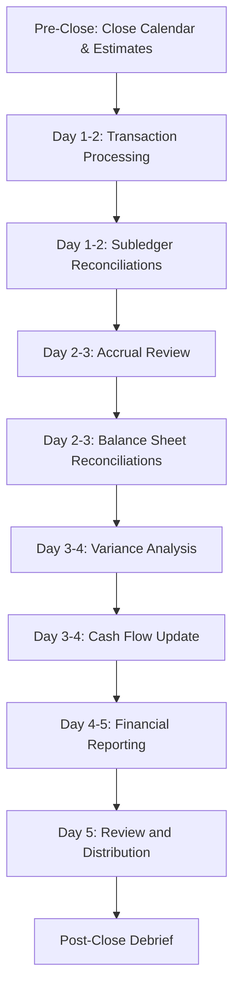

# Month-End Close Orchestration

## Overview
Orchestrated month-end close process workflow with automated checks, coordinated activities across finance team, and timely completion of all close requirements.

## Objective
Execute a comprehensive, accurate, and timely month-end close process that produces reliable financial statements, variance analysis, and management reports within target timeline (typically 3-5 business days).

## Workflow Steps

### Day -1 to 0: Pre-Close Activities

**Agent**: financial-reporter
**Command**: /month-end-close-status
**Activities**:
- Distribute close calendar and checklist
- Review open items from prior month
- Communicate close timeline to stakeholders
- Prepare accrual estimates for major items
- Pre-close variance analysis draft (based on flash estimates)

**Output**:
- Close checklist with owners and due dates
- Pre-close estimate of results
- Outstanding items list

---

### Day 1-2: Transaction Processing and Subledger Close

**Agent**: financial-reporter
**Command**: /month-end-close-status
**Activities**:

**Transaction Processing:**
- Verify all invoices processed and approved
- Post all recurring journal entries
- Process payroll and payroll taxes
- Record revenue recognition entries (ASC 606 compliance)
- Post depreciation and amortization
- Record intercompany transactions

**Subledger Reconciliations:**
- Reconcile A/R subledger to GL
- Reconcile A/P subledger to GL
- Reconcile inventory to GL (if applicable)
- Reconcile fixed assets and accumulated depreciation
- Reconcile payroll to GL

**Skills**: gaap-ifrs-compliance, cash-flow-management
**Output**:
- All transactions posted
- Subledger reconciliations complete
- Identified discrepancies flagged for resolution

---

### Day 2-3: Accrual Processing and Balance Sheet Reconciliation

**Agent**: financial-reporter
**Command**: /accrual-review
**Parameters**:
- Period: [Current month]
- Threshold: $50,000
- Focus: payroll, bonuses, professional-fees

**Activities**:
- Review and record all accruals (payroll, benefits, bonuses, professional fees, utilities, etc.)
- Validate accrual calculations and supporting documentation
- Record deferred revenue adjustments
- Process prepaid expense amortization
- Record tax accruals (income tax, sales tax, property tax)

**Agent**: financial-reporter
**Skills**: gaap-ifrs-compliance, management-reporting
**Activities**:
- Reconcile all balance sheet accounts
- Bank reconciliations
- Intercompany account reconciliation and elimination
- Prepaid and accrued expense analysis
- Deferred revenue reconciliation
- Debt and interest reconciliation
- Investigate and resolve reconciliation differences

**Output**:
- All accruals recorded with supporting documentation
- Balance sheet accounts reconciled
- Reconciliation differences resolved or explained

---

### Day 3-4: Variance Analysis and Review

**Agent**: budget-variance-analyst
**Command**: /budget-variance
**Parameters**:
- Period: [Current month]
- Departments: all
- Threshold: "$50K or 10%"
- Focus: revenue, major expense categories

**Activities**:
- Calculate variances (budget vs. actual, prior year)
- Identify material variances above threshold
- Investigate root causes with department leaders
- Prepare variance explanations (1-2 sentences per item)
- Document business context and drivers
- Assess full-year forecast impact

**Agent**: cash-flow-analyst
**Command**: /cash-flow-projection
**Parameters**:
- Horizon: "13-weeks"
- Start date: [First day of next month]
- Scenarios: "base,stressed"

**Activities**:
- Update cash flow forecast with actual month-end cash
- Project next 13 weeks based on latest trends
- Assess runway and liquidity
- Identify potential cash shortfalls

**Skills**: budget-variance-analysis, cash-flow-management, financial-forecasting-methods
**Output**:
- Comprehensive variance analysis report
- Executive summary of financial performance
- Updated cash flow forecast and runway analysis

---

### Day 4-5: Financial Reporting and Review

**Agent**: financial-reporter
**Command**: /kpi-dashboard
**Parameters**:
- Type: "executive"
- Period: [Current month]
- Format: "pdf"

**Activities**:
- Generate financial statements (P&L, Balance Sheet, Cash Flow)
- Create KPI dashboard
- Compile executive summary
- Prepare management reporting package
- Review for accuracy and completeness
- Management review and sign-off

**Skills**: management-reporting, gaap-ifrs-compliance, budget-variance-analysis
**Output**:
- Income Statement (actual, budget, variance, prior year)
- Balance Sheet (current period, comparatives)
- Cash Flow Statement
- KPI dashboard
- Variance analysis
- Executive summary
- Complete monthly financial package

---

### Day 5: Distribution and Post-Close

**Agent**: financial-reporter
**Activities**:
- Final review and approval from CFO
- Distribute financial package to stakeholders
- Upload to board portal (if board month)
- Archive supporting documentation
- Update close metrics (days to close, reconciliation timeliness)
- Post-close debrief with finance team
- Document lessons learned and improvements

**Output**:
- Financial package distributed
- Close completed within target timeline
- Metrics tracked
- Improvement opportunities identified

---

## Orchestration Flow

## Key Milestones and Gates

**Day 1 Gate**:
- All transactions for prior month posted
- GL locked (no further entries without approval)
- Subledgers balanced to GL

**Day 3 Gate**:
- All accruals recorded
- Balance sheet reconciliations complete (or documented exceptions)
- Material reconciliation differences resolved

**Day 5 Gate**:
- Variance analysis complete with explanations
- Financial statements finalized
- Management review and approval obtained
- Distribution to stakeholders

## Success Metrics

**Timeliness:**
- Target: 5 business days from month-end
- Actual: [Track each month]
- Trend: Improving / stable / declining

**Accuracy:**
- Post-close adjustments: Target <5 per month
- Reconciliation differences: <$X or resolve by Day 3
- Variance explanation coverage: >95% of material items

**Quality:**
- Financial statement accuracy
- Variance analysis quality and depth
- Stakeholder satisfaction with reporting

## Continuous Improvement

**Monthly Debrief Topics:**
- Bottlenecks and delays
- Process improvements identified
- Automation opportunities
- Resource constraints
- Best practices from prior months

**Quarterly Close Process Review:**
- Review close metrics trends
- Implement process improvements
- Update close checklist and calendar
- Training needs identification
- Technology enhancements

## Exception Handling

**If Behind Schedule:**
- Daily stand-up meetings
- Prioritize critical path activities
- Escalate blockers immediately
- Reallocate resources as needed
- Communicate revised timeline

**If Material Errors Found:**
- Document error and impact
- Correct immediately
- Analyze root cause
- Implement control to prevent recurrence
- Consider prior period adjustment if material

## Integration Points

**Systems:**
- NetSuite/SAP: Transaction processing, GL, subledgers
- Workday: Payroll data for accruals
- Expense systems: For accrual estimates
- Spreadsheets: Variance analysis, reconciliations, reporting

**Stakeholders:**
- Finance team: Execute close activities
- Department leaders: Provide variance explanations
- CFO: Review and approve
- Executives: Receive monthly package
- Board: Receive package (monthly or quarterly)

## Agents Involved
- **financial-reporter**: Primary orchestrator, reporting, reconciliations, accruals
- **budget-variance-analyst**: Variance analysis and explanations
- **cash-flow-analyst**: Cash flow updates and runway analysis

## Skills Utilized
- gaap-ifrs-compliance
- management-reporting
- budget-variance-analysis
- cash-flow-management
- financial-forecasting-methods

## Related Commands
- /month-end-close-status
- /accrual-review
- /budget-variance
- /cash-flow-projection
- /kpi-dashboard

---

**Orchestration Type**: Recurring monthly workflow
**Typical Duration**: 5 business days
**Complexity**: High (multiple agents, dependencies, tight timeline)
**Automation Potential**: High (recurring entries, reconciliations, reports)
