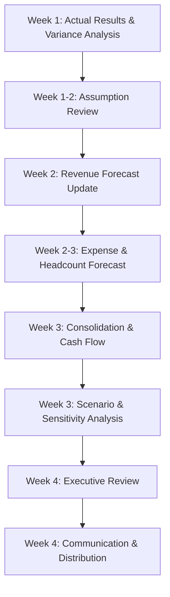

# Quarterly Forecast Update Orchestration

## Overview
Quarterly forecast update cycle with comprehensive variance analysis, assumption updates, and reforecasting to maintain rolling 4-6 quarter visibility.

## Objective
Update financial forecast quarterly based on actual performance, revised assumptions, and latest business intelligence to provide accurate outlook for decision-making and stakeholder communication.

## Workflow Steps

### Week 1: Actual Results Analysis and Variance Review

**Agent**: budget-variance-analyst
**Command**: /budget-variance
**Parameters**:
- Period: [Completed quarter]
- Departments: all
- Threshold: "$100K or 10%"

**Activities**:
- Analyze Q[X] actual results vs. forecast
- Calculate variances for all key metrics
- Identify systematic forecast bias (over/under forecasting)
- Document variance drivers and root causes
- Assess which variances are temporary vs. permanent

**Output**:
- Quarterly variance analysis
- Identification of forecast accuracy issues
- Permanent vs. temporary variance classification

---

### Week 1-2: Assumption Review and Update

**Agent**: financial-forecaster
**Skills**: financial-forecasting-methods, scenario-planning
**Activities**:

**Revenue Assumptions:**
- Customer acquisition trends (actual vs. forecast)
- Churn rates (actual vs. forecast)
- ARPU/ACV trends and pricing
- Pipeline quality and conversion rates
- Seasonality adjustments
- Market conditions update
- Competitive landscape changes

**Expense Assumptions:**
- Headcount plan vs. actual hires
- Attrition rates
- Compensation trends (salary, benefits, bonuses)
- Software and technology spending
- Marketing efficiency and ROI
- Professional services needs
- Facilities and other fixed costs

**Other Assumptions:**
- CapEx timing and amounts
- Working capital trends (DSO, DPO)
- Tax rates
- Interest rates (if debt)
- FX rates (if international)

**Output**:
- Updated assumption book
- Documented rationale for changes
- Comparison to prior forecast assumptions

---

### Week 2: Revenue Forecast Update

**Agent**: financial-forecaster
**Command**: /financial-forecast
**Parameters**:
- Type: "rolling-4q"
- Base period: [Current quarter]
- Scenarios: "base,upside,downside"

**Activities**:
- Build updated revenue model using revised assumptions
- Customer/user forecast by cohort
- ARPU/ACV projections
- New business vs. expansion vs. churn
- Seasonality application
- Scenario development (base, upside, downside)

**Skills**: financial-forecasting-methods, financial-modeling
**Output**:
- Updated revenue forecast (4-6 quarters)
- Revenue by segment, product, geography
- Customer and ARPU/ACV assumptions
- Three scenarios (base, upside, downside)

---

### Week 2-3: Expense and Headcount Forecast Update

**Agent**: financial-forecaster
**Skills**: financial-forecasting-methods, cost-allocation
**Activities**:

**Headcount Forecast:**
- Update hiring plan based on latest recruiting pipeline
- Adjust attrition assumptions
- Update compensation assumptions (raises, bonuses)
- Department-by-department headcount forecast
- Calculate personnel expenses (salary, benefits, bonuses, stock comp)

**Non-Personnel Expenses:**
- Update software and technology spend
- Revise marketing budget based on ROI and pipeline needs
- Adjust professional services forecast
- Update facilities costs
- Revise T&E based on latest trends

**CapEx Forecast:**
- Review CapEx project status and timing
- Adjust for delays or accelerations
- Add new projects identified
- Remove cancelled projects

**Output**:
- Updated headcount forecast by department
- Personnel expense forecast
- Non-personnel expense forecast by category
- CapEx forecast by project

---

### Week 3: Consolidated Forecast Build

**Agent**: financial-forecaster
**Skills**: financial-modeling, cash-flow-management
**Activities**:
- Consolidate revenue and expense forecasts
- Build complete P&L forecast (4-6 quarters)
- Update balance sheet forecast (working capital, CapEx, debt)
- Generate cash flow forecast
- Calculate key metrics (margins, runway, ratios)
- Ensure internal consistency (three-statement linkage)

**Agent**: cash-flow-analyst
**Command**: /cash-flow-projection
**Parameters**:
- Horizon: "quarterly"
- Start date: [Current quarter]
- Scenarios: "base,stressed"

**Activities**:
- Detailed cash flow projection from updated P&L forecast
- Working capital assumptions and impacts
- CapEx timing
- Debt service
- Runway calculation
- Liquidity assessment

**Output**:
- Complete financial forecast (P&L, Balance Sheet, Cash Flow)
- Three scenarios (base, upside, downside)
- Cash runway and liquidity analysis
- Key metrics dashboard

---

### Week 3: Scenario and Sensitivity Analysis

**Agent**: fpa-advisor
**Command**: /scenario-analysis
**Parameters**:
- Decision: "forecast-scenarios"
- Horizon: "4-quarters"
- Scenarios: "base,upside,downside,stressed"

**Activities**:
- Develop detailed scenario narratives
- Quantify scenario differences
- Sensitivity analysis on key assumptions
- Risk assessment
- Opportunity assessment
- Probability weighting

**Skills**: scenario-planning, financial-modeling
**Output**:
- Scenario comparison (financial impact by scenario)
- Sensitivity analysis (key drivers)
- Risk and opportunity assessment
- Probability-weighted expected values

---

### Week 4: Executive Review and Finalization

**Agent**: fpa-advisor
**Skills**: management-reporting, financial-forecasting-methods
**Activities**:
- Prepare forecast review package
- Executive summary (key changes from prior forecast)
- Scenario comparison
- Key assumptions and risks
- Executive team review session
- Incorporate feedback
- Final approval

**Output**:
- Finalized forecast (approved by executive team)
- Executive summary of changes
- Communication plan for stakeholders

---

### Week 4: Communication and Distribution

**Agent**: financial-reporter
**Skills**: management-reporting
**Activities**:
- Board communication (if guidance update)
- Department leader communication (impact on budgets)
- Update financial reporting systems
- Document forecast assumptions and rationale
- Train teams on new forecast

**If Significant Change:**
- Update external guidance (for public companies)
- Investor communication
- Board pre-approval

**Output**:
- Forecast distributed to stakeholders
- Guidance updated (if applicable)
- Systems updated with new forecast
- Documentation archived

---

## Orchestration Flow

## Key Milestones

**End of Week 1:**
- Variance analysis complete
- Forecast accuracy assessment done
- Key assumption update areas identified

**End of Week 2:**
- Revenue forecast updated
- Major assumptions revised and documented

**End of Week 3:**
- Consolidated forecast complete (all scenarios)
- Cash flow and sensitivity analysis done
- Forecast review package prepared

**End of Week 4:**
- Executive approval obtained
- Forecast communicated to stakeholders
- Systems updated

## Success Metrics

**Forecast Quality:**
- Forecast accuracy (MAPE <15% for revenue, <10% for expenses)
- Forecast bias (near zero - not systematically over/under)
- Completeness (all key assumptions documented)

**Process Efficiency:**
- Cycle time: 4 weeks target
- Iterations required: <2
- Stakeholder satisfaction with process

**Business Impact:**
- Forecast used in decision-making
- Enables proactive management
- Identifies risks early
- Supports resource planning

## Cadence

**Quarterly** (4 times per year):
- Q1 close: Update forecast for Q2-Q4 + Q1 next year
- Q2 close: Update forecast for Q3-Q4 + Q1-Q2 next year
- Q3 close: Update forecast for Q4 + full next year (pre-budget)
- Q4 close: Update forecast for next year (post-budget refinement)

## Integration with Annual Budget

**Q3 Forecast Update:**
- Serves as starting point for annual budget
- Validates strategic assumptions for next year
- Identifies gaps to strategic targets

**Post-Budget (Q4) Forecast:**
- Incorporates approved annual budget
- Refines based on latest Q4 trends
- Sets baseline for next year variance tracking

## Exception Handling

**Material Forecast Miss:**
- If quarterly variance >20%: Conduct special review
- Assess root causes (forecast methodology vs. business changes)
- Implement corrections for next forecast cycle

**Significant Business Changes:**
- M&A activity
- Major customer win/loss
- Market disruption
- Regulatory changes
→ May trigger off-cycle forecast update

## Agents Involved
- **budget-variance-analyst**: Actual results analysis, variance review
- **financial-forecaster**: Forecast model updates, assumption revisions
- **cash-flow-analyst**: Cash flow projections, runway analysis
- **fpa-advisor**: Scenario planning, executive review, communication

## Skills Utilized
- budget-variance-analysis
- financial-forecasting-methods
- financial-modeling
- cash-flow-management
- scenario-planning
- management-reporting

## Related Commands
- /budget-variance
- /financial-forecast
- /cash-flow-projection
- /scenario-analysis

---

**Orchestration Type**: Recurring quarterly workflow
**Typical Duration**: 4 weeks
**Complexity**: High (multiple agents, cross-functional coordination)
**Business Value**: Critical for planning and resource allocation
