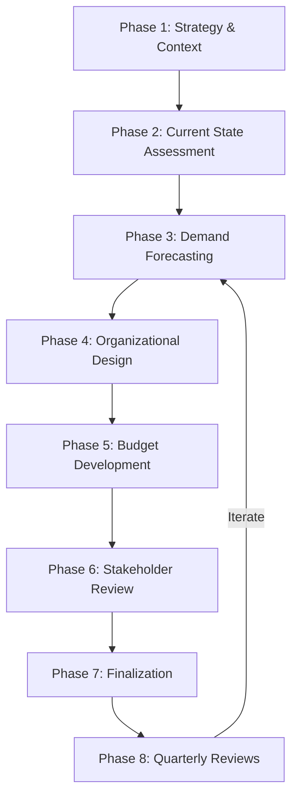

# Annual Workforce Planning Orchestration

## Overview
Comprehensive annual workforce planning process integrating headcount forecasting, budget planning, organizational design, and talent strategy aligned with business objectives.

## Objective
Develop strategic workforce plan for the next fiscal year that aligns talent needs with business goals, optimizes organizational structure, ensures budget alignment, and positions the organization for growth and success.

## Workflow Steps

### Phase 1 (Weeks 1-2): Business Context & Strategic Alignment

**Agent**: workforce-planner
**Command**: /headcount-plan --timeframe "FY2025" --org "all" --growth-rate "strategic-plan"
**Activities**:
- Review business strategy and growth objectives
- Understand revenue targets, product roadmap, market expansion plans
- Identify strategic initiatives requiring new capabilities
- Gather input from executive team on priorities
- Review current fiscal year performance vs. plan

**Output**:
- Business strategy summary
- Key growth drivers and assumptions
- Strategic initiatives requiring workforce support
- Executive priorities and constraints

---

### Phase 2 (Weeks 3-4): Current State Assessment

**Agent**: workforce-planner
**Activities**:
- Analyze current headcount by function, level, role
- Assess span of control and organizational health
- Calculate revenue per employee and productivity metrics
- Review utilization and capacity by team
- Identify organizational structure issues

**Agent**: attrition-predictor
**Command**: /attrition-analysis --period "last 24 months" --segment "all"
**Activities**:
- Analyze historical attrition patterns and trends
- Forecast attrition for planning year
- Identify high-risk cohorts requiring retention focus
- Calculate attrition cost impact

**Agent**: compensation-analyst
**Command**: /compensation-review --org "all" --roles "all"
**Activities**:
- Benchmark current compensation vs. market
- Identify competitive gaps and retention risks
- Estimate compensation inflation for planning year
- Project merit increase and promotion budget needs

**Skills**: workforce-planning-models, attrition-analysis, compensation-benchmarking
**Output**:
- Current state dashboard (HC, structure, productivity)
- Attrition forecast and retention strategy
- Compensation competitiveness assessment
- Organizational health indicators

---

### Phase 3 (Weeks 5-6): Demand Forecasting & Scenario Modeling

**Agent**: workforce-planner
**Command**: /headcount-plan --scenarios "conservative,base,aggressive"
**Activities**:
- Develop driver-based headcount forecasts by function
  - Sales: Revenue target ÷ quota per rep
  - CS: Customer count ÷ CSM capacity
  - Engineering: Product roadmap capacity requirements
  - Operations: Volume/transactions ÷ productivity
  - G&A: Ratios to total company headcount
- Model three scenarios (conservative/base/aggressive)
- Account for productivity improvements and automation
- Factor in new hire ramp time (3-6 months)
- Calculate quarterly phasing of hires

**Agent**: workforce-planner
**Command**: /skills-gap-analysis --org "all" --initiative "strategic-priorities"
**Activities**:
- Identify critical skills for strategic initiatives
- Assess current skills inventory vs. required capabilities
- Determine build vs. buy recommendations
- Plan workforce development programs

**Skills**: workforce-planning-models, skills-gap-analysis
**Output**:
- Headcount forecast by function/quarter (3 scenarios)
- Driver-based model assumptions
- Skills gap analysis and development plan
- Capacity modeling by team

---

### Phase 4 (Weeks 7-8): Organizational Design & Structure

**Agent**: workforce-planner
**Activities**:
- Optimize organizational structure for growth
- Analyze span of control and management layers
- Identify reporting relationship changes
- Plan new team formations or reorgs
- Design career paths and level structures
- Address succession planning needs

**Agent**: workforce-planner
**Command**: /talent-pipeline --level "Director+"
**Activities**:
- Assess succession readiness for critical roles
- Identify high-potential employees for advancement
- Plan promotion pipeline and timing
- Address succession gaps through hiring or development

**Skills**: workforce-planning-models, skills-gap-analysis
**Output**:
- Organizational design recommendations
- Span of control optimization plan
- Succession planning assessment
- Promotion pipeline and timing

---

### Phase 5 (Weeks 9-10): Budget Development & Scenario Refinement

**Agent**: compensation-analyst
**Activities**:
- Calculate fully loaded compensation costs:
  - Base salaries by role/level/location
  - Bonus and commission targets
  - Equity/stock compensation
  - Benefits and payroll taxes
  - Merit increase budget (3-4%)
  - Promotion budget (8-15% per promo)
- Model compensation budget by scenario
- Identify budget optimization opportunities
- Plan geographic expansion compensation strategy

**Agent**: workforce-planner
**Activities**:
- Refine headcount scenarios based on budget constraints
- Prioritize hiring by strategic importance
- Phase hiring to optimize cash flow
- Model fast-track, base, and extended hiring timelines
- Calculate net headcount change and growth rate

**Skills**: compensation-benchmarking, workforce-planning-models
**Output**:
- Fully loaded compensation budget by scenario
- Prioritized hiring plan with phasing
- Budget optimization recommendations
- Sensitivity analysis (impact of delays, higher attrition)

---

### Phase 6 (Weeks 11-12): Stakeholder Review & Iteration

**Agent**: workforce-planner
**Activities**:
- Present workforce plan to executive team
- Facilitate discussion on scenarios and trade-offs
- Incorporate feedback on priorities and constraints
- Refine plan based on stakeholder input
- Align on recommended scenario (conservative/base/aggressive)
- Secure executive approval on headcount targets

**Output**:
- Revised workforce plan incorporating feedback
- Executive alignment on scenario selection
- Approved headcount targets by function/quarter
- Budget approval and constraints documented

---

### Phase 7 (Weeks 13-14): Finalization & Communication

**Agent**: workforce-planner
**Activities**:
- Finalize annual workforce plan document
- Prepare executive presentation
- Develop communication materials for company
- Create implementation roadmap and milestones
- Assign ownership for hiring targets by function
- Establish quarterly review cadence

**Output**:
- Final workforce plan document
- Executive presentation deck
- Implementation roadmap with milestones
- Communication plan and materials
- Quarterly review schedule

---

### Phase 8 (Ongoing): Quarterly Review & Adjustment

**Agent**: workforce-planner
**Command**: /headcount-plan --update "Q1-actuals"
**Activities**:
- Review quarterly actuals vs. plan
- Update forecast based on business performance
- Adjust hiring priorities and phasing
- Address variances and changes
- Communicate updates to stakeholders

**Cadence**: Quarterly throughout fiscal year
**Output**:
- Quarterly actuals vs. plan review
- Revised forecast and priorities
- Stakeholder updates

---

## Orchestration Flow

## Key Milestones and Gates

**Week 2 Gate**: Business strategy and priorities confirmed
**Week 4 Gate**: Current state assessment complete
**Week 6 Gate**: Demand scenarios modeled
**Week 8 Gate**: Organizational design recommendations ready
**Week 10 Gate**: Budget scenarios developed
**Week 12 Gate**: Executive approval obtained
**Week 14 Gate**: Final plan published and communicated

## Success Metrics

**Alignment**:
- Workforce plan aligned with business strategy and growth targets
- Stakeholder buy-in across executive team
- Cross-functional alignment on priorities

**Comprehensiveness**:
- All functions covered with detailed forecasts
- Scenarios model range of outcomes
- Budget implications clearly quantified
- Skills gaps identified and addressed

**Actionability**:
- Clear hiring priorities and phasing
- Ownership assigned for execution
- Quarterly review cadence established
- Progress tracking mechanisms in place

**Accuracy** (measured post-year):
- Actual headcount within 10% of plan
- Attrition forecast within 3 percentage points
- Budget accuracy within 15%

## Continuous Improvement

**Quarterly Planning Reviews**:
- Actuals vs. plan variance analysis
- Business changes requiring forecast update
- Hiring velocity and time-to-fill tracking
- Attrition trends vs. forecast

**Annual Process Review** (post-cycle):
- Planning process effectiveness
- Stakeholder satisfaction survey
- Forecast accuracy assessment
- Process improvements for next cycle

## Exception Handling

**If Business Strategy Changes Mid-Year**:
- Trigger mid-year reforecast
- Adjust hiring priorities and phasing
- Communicate changes to stakeholders
- Update budget implications

**If Attrition Higher Than Forecast**:
- Increase backfill hiring
- Accelerate retention programs
- Assess root causes
- Revise attrition assumptions for remaining quarters

**If Hiring Velocity Below Plan**:
- Increase recruiting capacity
- Adjust offer competitiveness
- Simplify interview process
- Consider alternative sourcing strategies

## Integration Points

**Systems**:
- HRIS (Workday, BambooHR): Headcount, attrition, org structure data
- Financial Planning (Anaplan, Adaptive): Budget integration
- Compensation (Pave, Carta): Market data and compensation planning
- ATS (Greenhouse, Lever): Recruiting pipeline and velocity

**Stakeholders**:
- CEO: Strategy alignment, final approval
- CFO: Budget alignment, scenario selection
- Functional Leaders: Input on needs, ownership of hiring
- HR Leadership: Orchestration, feasibility assessment
- Recruiting: Capacity and execution planning

## Agents Involved
- **workforce-planner**: Primary orchestrator, demand forecasting, organizational design
- **attrition-predictor**: Attrition forecasting and retention strategy
- **compensation-analyst**: Compensation budgeting and market analysis

## Skills Utilized
- workforce-planning-models
- attrition-analysis
- compensation-benchmarking
- skills-gap-analysis

## Related Commands
- /headcount-plan
- /attrition-analysis
- /compensation-review
- /skills-gap-analysis
- /talent-pipeline

---

**Orchestration Type**: Annual strategic planning process
**Typical Duration**: 14 weeks (quarter)
**Complexity**: High (cross-functional, strategic, multiple agents)
**Automation Potential**: Medium (data gathering, modeling, reporting)
