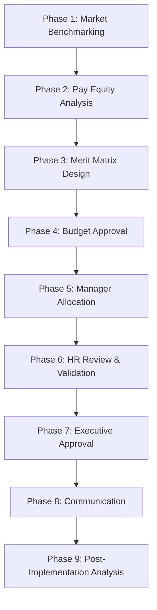

# Annual Compensation Planning Orchestration

## Overview
Comprehensive annual compensation planning process including market benchmarking, pay equity analysis, merit increase planning, promotion planning, and total rewards strategy aligned with budget and retention objectives.

## Objective
Develop fair, competitive, and fiscally responsible compensation plan that rewards performance, retains top talent, maintains internal equity, and operates within approved budget parameters.

## Workflow Steps

### Phase 1 (Weeks 1-2): Planning Kickoff & Market Benchmarking

**Agent**: compensation-analyst
**Command**: /compensation-review --org "all" --roles "all"
**Activities**:
- Secure access to market benchmark data (Radford, Mercer, Payscale, Levels.fyi)
- Match internal roles to market job codes
- Extract market data (P25, P50, P75, P90) for all roles
- Adjust for geographic locations
- Calculate current compa-ratios (salary / midpoint)
- Identify competitive gaps and risks

**Output**:
- Market benchmarking report by role/level
- Compa-ratio distribution analysis
- Competitive risk assessment (employees below market)
- Geographic pay differential analysis

---

### Phase 2 (Weeks 3-4): Pay Equity Analysis

**Agent**: compensation-analyst
**Activities**:
- Conduct statistical regression analysis for pay equity
- Control for legitimate factors (level, tenure, performance, location)
- Analyze by protected class (gender, race, age)
- Identify statistically significant pay gaps
- Flag individual employees >2 standard deviations from expected
- Quantify remediation cost

**Skills**: compensation-benchmarking, diversity-inclusion-metrics
**Output**:
- Pay equity analysis report with statistical findings
- Individual-level equity adjustments needed
- Total remediation budget estimate
- Compliance assessment

---

### Phase 3 (Weeks 5-6): Performance Integration & Merit Matrix Design

**Agent**: performance-analytics-agent
**Command**: /performance-distribution --cycle "current" --org "all"
**Activities**:
- Finalize performance ratings (see Performance Review Cycle)
- Analyze performance distribution across organization
- Validate performance-compensation correlation from prior year

**Agent**: compensation-analyst
**Activities**:
- Design merit increase matrix (performance × compa-ratio)
- Model merit budget scenarios (3%, 3.5%, 4% total budget)
- Balance performance differentiation with budget constraints
- Design promotion increase guidelines (8-15% by level)
- Plan equity compensation pool (RSUs, options)

**Merit Matrix Example (3% total budget)**:
```
                  Low Compa (<0.95) | Mid Compa (0.95-1.05) | High Compa (>1.05)
Exceptional       7%                 | 5.5%                  | 4%
Exceeds           5%                 | 4%                    | 3%
Meets             3.5%               | 2.5%                  | 1.5%
Developing        1%                 | 0.5%                  | 0%
```

**Skills**: performance-management, compensation-benchmarking
**Output**:
- Merit increase matrix with scenario options
- Budget validation (weighted average = 3%)
- Promotion budget and guidelines
- Equity compensation plan

---

### Phase 4 (Week 7): Budget Scenario Modeling & Approval

**Agent**: compensation-analyst
**Activities**:
- Model total compensation budget by scenario:
  - Conservative: 3% merit, limited equity adjustments
  - Base: 3.5% merit, targeted equity adjustments
  - Aggressive: 4% merit, comprehensive equity program
- Include pay equity remediation budget
- Include promotion budget (estimated # of promotions)
- Calculate fully loaded cost (base + bonus + equity + taxes)
- Assess affordability and cash flow impact

**Scenario Comparison**:
```
                    | Conservative | Base | Aggressive
Total Merit Budget  | $1.2M (3%)   | $1.4M (3.5%) | $1.6M (4%)
Pay Equity          | $200K        | $200K | $200K
Promotions          | $300K (15)   | $400K (20) | $500K (25)
Equity Pool         | $500K        | $750K | $1.0M
Total               | $2.2M        | $2.75M | $3.3M
```

**Output**:
- Compensation budget scenarios with full cost breakdown
- CFO/CEO recommendation and approval
- Approved budget and scenario selection

---

### Phase 5 (Weeks 8-9): Manager Allocation & Planning

**Agent**: compensation-analyst
**Activities**:
- Distribute merit guidelines and matrix to managers
- Provide manager training on merit allocation
- Allocate merit budget by department
- Share employee compa-ratios and performance ratings with managers
- Provide decision support tools (merit calculators)

**Managers**:
- Review team compensation and performance
- Allocate merit increases per matrix guidelines
- Plan promotion increases
- Identify retention risks requiring special treatment
- Submit recommendations

**Skills**: compensation-benchmarking, performance-management
**Output**:
- Manager merit allocation recommendations
- Promotion nominations with justifications
- Retention cases flagged

---

### Phase 6 (Week 10): HR Review & Equity Validation

**Agent**: compensation-analyst
**Activities**:
- Review manager allocations for compliance with matrix
- Validate budget adherence by department
- Identify outliers (off-matrix decisions requiring justification)
- Check for compression (new hire > tenured employee)
- Check for inversion (junior > senior, IC > manager)
- Validate pay equity post-merit (no adverse impact)

**Post-Merit Equity Check**:
- Re-run regression analysis with proposed increases
- Ensure no new pay gaps created
- Flag any concerning patterns

**Agent**: compensation-analyst
**Command**: /compensation-review --post-merit "true"
**Activities**:
- Generate post-merit compa-ratio distribution
- Assess market competitiveness after increases
- Identify remaining competitive gaps

**Skills**: compensation-benchmarking, diversity-inclusion-metrics
**Output**:
- Validated merit allocations
- Equity and fairness certification
- Outlier review and approval
- Final merit plan by employee

---

### Phase 7 (Week 11): Executive Approval & Finalization

**Agent**: compensation-analyst
**Activities**:
- Present final compensation plan to executive team
- Show aggregate budget by department
- Highlight key metrics (avg increase, distribution, equity)
- Review outliers and special cases
- Obtain final approval

**Output**:
- Executive approval on compensation plan
- Final merit increases by employee
- Promotion increases finalized
- Equity grants approved

---

### Phase 8 (Week 12): Communication & Delivery

**Agent**: compensation-analyst
**Activities**:
- Prepare manager communication materials
- Develop employee communication templates
- Train managers on delivering compensation conversations
- Process increases in payroll system
- Update HRIS with new salaries and promotions

**Managers**:
- Communicate increases to employees in 1:1s
- Explain merit increase rationale (performance + compa-ratio)
- Discuss compensation philosophy and market positioning
- Answer employee questions
- Deliver promotion letters

**Communication Framework**:
1. Company performance and compensation budget context
2. Individual performance rating and merit increase %
3. Compa-ratio and market positioning
4. Total compensation (base + bonus + equity)
5. Career development and future opportunities

**Skills**: performance-management, compensation-benchmarking
**Output**:
- Compensation increases communicated to all employees
- Manager communication completion tracking
- Employee questions addressed
- Increases effective in payroll

---

### Phase 9 (Weeks 13-14): Post-Implementation Analysis

**Agent**: compensation-analyst
**Activities**:
- Post-merit compa-ratio distribution analysis
- Market competitiveness assessment
- Pay equity validation (regression with new salaries)
- Budget vs. actual variance analysis
- Manager and employee feedback collection

**Agent**: attrition-predictor
**Command**: /attrition-analysis --focus "compensation-risk"
**Activities**:
- Update flight risk model with new compensation data
- Identify employees still at retention risk
- Recommend additional retention actions

**Skills**: compensation-benchmarking, attrition-analysis, diversity-inclusion-metrics
**Output**:
- Post-merit compensation analysis report
- Pay equity certification
- Retention risk assessment
- Process improvement recommendations for next cycle

---

## Orchestration Flow



## Key Milestones and Gates

**Week 2 Gate**: Market benchmarking complete
**Week 4 Gate**: Pay equity analysis complete, remediation budget identified
**Week 6 Gate**: Merit matrix designed and modeled
**Week 7 Gate**: Budget approved by CFO/CEO
**Week 9 Gate**: Manager allocations submitted
**Week 10 Gate**: HR review complete, equity validated
**Week 11 Gate**: Executive approval obtained
**Week 12 Gate**: Increases communicated to employees
**Week 14 Gate**: Post-implementation analysis complete

## Success Metrics

**Budget & Compliance**:
- Actual merit spend within 2% of budget
- Pay equity gaps addressed (no statistically significant gaps post-merit)
- Legal compliance with pay transparency regulations

**Market Competitiveness**:
- 90%+ employees within competitive compa-ratio range (0.95-1.05)
- Critical roles at or above market median
- High-performer retention (>90% retention of top performers)

**Internal Equity**:
- Performance differentiation achieved (merit spread >3% between Exceptional and Meets)
- No compression or inversion issues
- Fair distribution across demographics

**Stakeholder Satisfaction**:
- Manager satisfaction with process >4.0/5.0
- Employee understanding of compensation philosophy >4.0/5.0
- CFO satisfaction with budget process and adherence

**Retention Impact**:
- Attrition within 6 months of increases <3% (lower than baseline)
- High-performer retention >95%

## Continuous Improvement

**Post-Cycle Review**:
- Process efficiency and timeline assessment
- Manager feedback on tools and guidelines
- Employee feedback on communication
- Budget accuracy and variance analysis

**Annual Enhancements**:
- Market data sources and accuracy
- Merit matrix refinement
- Manager training effectiveness
- Technology and tool improvements

## Exception Handling

**If Budget Insufficient**:
- Prioritize high-performer and retention-risk increases
- Phase increases over multiple cycles
- Focus on equity and market gaps first
- Communicate budget constraints transparently

**If Pay Equity Gaps Identified**:
- Allocate separate budget for remediation
- Phase remediation over 1-2 cycles if cost-prohibitive
- Prioritize statistically significant gaps
- Establish review process for new hires/promotions

**If Manager Allocations Off Matrix**:
- Review justification with manager
- Assess validity of exception
- Approve or request revision
- Document approval for exceptions

**If Attrition Spikes Post-Merit**:
- Conduct stay interviews with high-risk employees
- Analyze compensation competitiveness of departures
- Consider off-cycle adjustments for critical retention cases
- Review market data for recalibration

## Integration Points

**Systems**:
- Compensation Platforms (Pave, Carta): Market data, planning tools
- HRIS (Workday, BambooHR): Employee data, salary administration
- Payroll (ADP, Gusto): Increase processing
- Performance Management (Lattice, 15Five): Performance ratings

**Stakeholders**:
- CFO/Finance: Budget approval, financial planning
- CEO: Final approval, company strategy
- HR: Process orchestration, equity validation
- Managers: Merit allocation, communication
- Employees: Recipients of increases

## Agents Involved
- **compensation-analyst**: Primary orchestrator, benchmarking, equity, planning
- **performance-analytics-agent**: Performance data integration
- **attrition-predictor**: Retention risk assessment

## Skills Utilized
- compensation-benchmarking
- performance-management
- attrition-analysis
- diversity-inclusion-metrics

## Related Commands
- /compensation-review
- /performance-distribution
- /attrition-analysis
- /diversity-report
- /retention-analysis

---

**Orchestration Type**: Annual recurring planning cycle
**Typical Duration**: 14 weeks (quarter)
**Complexity**: Very High (budget, equity, performance linkage, confidentiality)
**Automation Potential**: Medium (analytics, allocation tools, compliance checks)
