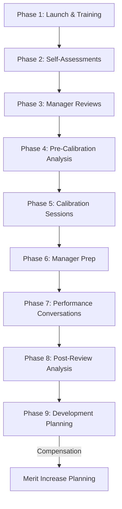

# Performance Review & Calibration Cycle Orchestration

## Overview
Comprehensive performance review cycle including self-assessments, manager reviews, calibration sessions, rating finalization, and performance conversations with linkage to compensation and development planning.

## Objective
Execute fair, consistent, and development-focused performance review cycle that differentiates performance, aligns standards across the organization, informs compensation decisions, and provides meaningful feedback to employees.

## Workflow Steps

### Phase 1 (Weeks 1-2): Cycle Launch & Preparation

**Agent**: performance-analytics-agent
**Activities**:
- Communicate performance cycle timeline and expectations
- Distribute performance review guidelines and templates
- Review rating scale definitions with managers
- Share calibration guidelines and distribution targets
- Provide manager training on feedback and review writing
- Set up performance management system

**Output**:
- Performance cycle calendar with key dates
- Manager training materials and completion
- Rating definitions and examples document
- Self-assessment and manager review templates
- Distribution guidelines (e.g., 10/30/50/10 for 5-point scale)

---

### Phase 2 (Weeks 3-4): Employee Self-Assessments

**Agent**: performance-analytics-agent
**Activities**:
- Employees complete self-assessments
- Reflect on accomplishments, goals achieved, challenges
- Self-rate performance (if applicable)
- Identify development areas and career aspirations
- Submit by deadline

**Completion Target**: 95% of employees
**Output**:
- Self-assessments submitted
- Completion tracking and follow-up for stragglers

---

### Phase 3 (Weeks 5-6): Manager Reviews & Initial Ratings

**Agent**: performance-analytics-agent
**Activities**:
- Managers review employee self-assessments
- Draft performance review narratives with specific examples
- Assign initial performance ratings
- Review goals achievement and behavioral competencies
- Document rating justification (especially for Exceptional and Below ratings)
- Identify development needs and opportunities

**Skills**: performance-management
**Completion Target**: 100% of direct reports reviewed
**Output**:
- Manager reviews and initial ratings submitted
- Rating justifications documented

---

### Phase 4 (Weeks 7-8): Pre-Calibration Analysis

**Agent**: performance-analytics-agent
**Command**: /performance-distribution --cycle "2024 Annual" --org "all"
**Activities**:
- Aggregate ratings across organization
- Calculate distribution by org, manager, demographics
- Compare to distribution guidelines
- Identify outlier managers (>50% top ratings or <20%)
- Analyze demographic fairness (gender, race, tenure, level)
- Prepare calibration session materials

**Output**:
- Pre-calibration distribution analysis
- Manager-level summaries showing rating distributions
- Outlier identification for calibration focus
- Peer comparison data (similar roles across teams)
- Demographic fairness assessment

---

### Phase 5 (Weeks 9-10): Calibration Sessions

**Agent**: performance-analytics-agent
**Activities**:
- Facilitate calibration sessions by organization/function
- Review overall distribution vs. guidelines
- Discuss outlier teams and individuals
- Compare similar roles across teams for consistency
- Review Exceptional ratings (require strong evidence)
- Review Developing/Below ratings (confirm PIP plans)
- Adjust ratings to align with guidelines
- Document calibration decisions and rationale

**Calibration Structure**:
1. Present aggregate distribution and variances
2. Discuss outlier managers/teams
3. Peer comparisons for consistency
4. Rating adjustments and final alignment
5. Document decisions

**Agent**: performance-analytics-agent
**Command**: /performance-distribution --post-calibration "true"
**Activities**:
- Validate post-calibration distribution
- Ensure alignment with guidelines (within ±2% tolerance)
- Check demographic fairness post-calibration
- Document any remaining outliers with justification

**Skills**: performance-management, compensation-benchmarking
**Output**:
- Finalized performance ratings by employee
- Post-calibration distribution analysis
- Calibration session notes and decisions
- Approved variances from guidelines with rationale

---

### Phase 6 (Week 11): Manager Preparation for Conversations

**Agent**: performance-analytics-agent
**Activities**:
- Managers finalize review narratives with calibrated ratings
- Prepare for performance conversations
- Review conversation tips and scripts (especially for difficult conversations)
- Plan development discussions and goal setting
- Schedule 1:1s with all direct reports

**Output**:
- Finalized reviews ready for delivery
- Performance conversations scheduled
- Manager preparation complete

---

### Phase 7 (Weeks 12-13): Performance Conversations & Delivery

**Agent**: performance-analytics-agent
**Activities**:
- Managers conduct performance conversations with employees
- Deliver ratings and review feedback
- Discuss strengths, development areas, goals
- Have two-way dialogue and answer questions
- Discuss career aspirations and development plan
- Set goals for next cycle
- Obtain employee acknowledgment in system

**Conversation Framework**:
1. Overall performance summary and rating
2. Key accomplishments and strengths
3. Development areas and opportunities
4. Career discussion and aspirations
5. Goals for next cycle
6. Q&A and two-way dialogue

**Skills**: performance-management
**Completion Target**: 100% within 2 weeks
**Output**:
- Performance conversations completed
- Employee acknowledgment in system
- Development plans drafted
- Next cycle goals set

---

### Phase 8 (Week 14): Post-Review Analysis & Linkage to Compensation

**Agent**: performance-analytics-agent
**Command**: /performance-distribution --final "true"
**Activities**:
- Final distribution analysis and validation
- Performance-demographic analysis for compliance
- Link performance ratings to compensation planning
- Identify performance-compensation correlation
- Analyze performance-attrition correlation

**Agent**: compensation-analyst
**Activities**:
- Prepare merit increase matrix (performance × compa-ratio)
- Model merit budget scenarios
- Identify equity adjustments needed
- Plan promotion increases

**Skills**: performance-management, compensation-benchmarking, attrition-analysis
**Output**:
- Final performance distribution report
- Fairness and compliance validation
- Performance-compensation linkage analysis
- Merit increase planning inputs

---

### Phase 9 (Ongoing): Development Planning & Monitoring

**Agent**: performance-analytics-agent
**Activities**:
- Managers create development plans for direct reports
- Identify training and development needs
- Plan stretch assignments and mentorship
- Track goal progress quarterly
- Mid-year check-ins on performance and goals

**Cadence**: Quarterly check-ins, continuous feedback
**Output**:
- Individual development plans
- Training and development priorities
- Quarterly progress tracking
- Continuous feedback culture

---

## Orchestration Flow

## Key Milestones and Gates

**Week 2 Gate**: Cycle launched, managers trained
**Week 4 Gate**: 95% self-assessments complete
**Week 6 Gate**: 100% manager reviews complete
**Week 8 Gate**: Pre-calibration analysis ready
**Week 10 Gate**: Calibration complete, ratings finalized
**Week 13 Gate**: 100% performance conversations delivered
**Week 14 Gate**: Post-review analysis complete

## Success Metrics

**Completion & Timeliness**:
- 100% employee participation
- Reviews completed on schedule
- Performance conversations within 2 weeks of rating finalization

**Quality & Fairness**:
- Rating distribution aligns with guidelines (±2% tolerance)
- No statistically significant demographic disparities
- Manager and employee satisfaction scores >4.0/5.0
- Review quality (specific examples, actionable feedback)

**Impact**:
- Performance-merit correlation >0.6 (strong linkage)
- Performance-promotion correlation (top performers promoted at higher rates)
- Development plan completion rate >80%
- Goal setting completion rate 100%

**Process Efficiency**:
- Cycle duration 14 weeks or less
- Calibration efficiency (sessions <2 hours per 50 employees)
- Manager time investment reasonable (3-4 hours per direct report)

## Continuous Improvement

**Post-Cycle Survey**:
- Manager satisfaction with process
- Employee satisfaction with feedback quality
- Perceived fairness of ratings
- Suggestions for improvement

**Annual Process Review**:
- Cycle timeline effectiveness
- Rating scale and distribution guidelines
- Calibration process effectiveness
- Training needs identified
- System/tool improvements

## Exception Handling

**If Distribution Significantly Off Guidelines**:
- Conduct additional calibration round
- Provide manager coaching on standards
- Adjust ratings as needed with clear communication

**If Manager Delays Reviews**:
- Escalate to manager's manager
- Set hard deadlines with consequences
- Provide support to complete on time

**If Employee Disputes Rating**:
- Manager reviews feedback and justification
- HR partner reviews for fairness
- Appeal process if warranted
- Document decision and rationale

**If Performance Issues Identified**:
- Initiate Performance Improvement Plan (PIP)
- Document expectations and timeline (30-90 days)
- Weekly check-ins and progress tracking
- Clear consequences if not met

## Integration Points

**Systems**:
- Performance Management Platform (Workday, Lattice, 15Five, Culture Amp)
- HRIS (Workday, BambooHR): Employee data, org structure
- Compensation System (Pave): Merit planning integration

**Stakeholders**:
- Employees: Self-assessments, receiving feedback
- Managers: Reviews, calibration, conversations
- HR: Process orchestration, calibration facilitation
- Senior Leaders: Calibration participation, approval
- Compensation Team: Linkage to merit planning

## Agents Involved
- **performance-analytics-agent**: Primary orchestrator, distribution analysis, calibration support
- **compensation-analyst**: Merit planning integration, compa-ratio analysis

## Skills Utilized
- performance-management
- compensation-benchmarking
- attrition-analysis

## Related Commands
- /performance-distribution
- /compensation-review
- /attrition-analysis
- /diversity-report

---

**Orchestration Type**: Annual or semi-annual recurring cycle
**Typical Duration**: 14 weeks (quarter)
**Complexity**: High (high-touch, manual, requires calibration)
**Automation Potential**: Medium (analytics, distribution tracking, reminders)
